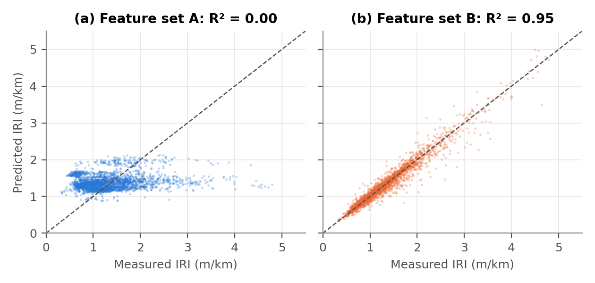

# Predicting Pavement Roughness (IRI) from Traffic and Climate

Regression and classification models of the International Roughness Index (IRI) on US Long-Term Pavement Performance (LTPP) data, with honest, leakage-aware validation.

**Author:** David Badu, Department of Civil Engineering, KNUST, Kumasi, Ghana

---

## Why this project

The International Roughness Index (IRI, in m/km) is the standard measure of how rough a road is, and it drives maintenance decisions. This project asks two questions:

1. How much of a pavement's roughness can traffic, climate and section history explain?
2. How much depends on simply knowing the pavement's earlier condition?

I built the project to apply everything from the *Supervised Machine Learning: Regression and Classification* course to a real pavement engineering dataset:

- linear regression written from scratch with gradient descent,
- feature scaling,
- polynomial features and regularisation,
- logistic regression.

I then went beyond the course with random forests, grouped cross-validation and checks for data leakage.

## Key findings

| Model (5-fold cross-validation, grouped by location) | R² | RMSE (m/km) |
|---|---|---|
| Predict the mean IRI | −0.02 | 0.592 |
| Linear regression, traffic + climate + section attributes | 0.04 | 0.575 |
| Random forest, same features | −0.03 | 0.597 |
| **Persistence:** next IRI = previous IRI | 0.91 | 0.178 |
| **Linear regression with previous IRI** | **0.93** | **0.160** |

1. **Traffic and climate alone explain very little roughness.** R² was about 0.04 on unseen locations, and no model type did better.
2. **Previous condition dominates.** Repeating the last measured IRI already gives R² = 0.91. The other features cut the error by about 10%. The useful ones were time since the last survey, freezing index and temperature.
3. **The validation design changes the conclusions.** A random forest seemed to explain 36% of the variation when folds were grouped by section. That fell to 11% when grouped by LTPP site, and to about 0% when grouped by location. The forest had been recognising places it had already seen.
4. **Classification of poor pavements** (IRI > 2.68 m/km): logistic regression with previous IRI caught 83% of poor observations at 88% precision. Persistence caught 71% at 93%.

<p align="center">
  <br>
  <em>Predicted against measured IRI on held-out locations: (a) traffic and climate only, (b) with previous IRI.</em>
</p>

## Repository contents

```
IRI-LTPP-ML/
├── data/
│   └── pavement_clean.csv          cleaned dataset (15,940 rows, 1,550 sections, 1989 to 2025)
├── notebooks/
│   └── iri_regression_classification.ipynb   the full step-by-step analysis (Steps 1 to 11)
├── src/
│   ├── clean_data.py               builds pavement_clean.csv from the raw LTPP exports
│   └── report_analysis.py          reproduces every number and figure in the report
├── figures/                        figures used in the report
├── results/
│   └── report_results.json         all numbers reported in the report
├── docs/
│   ├── IRI_Project_Report.pdf                      the write-up (11 pages)
│   ├── IRI_Project_Code_Guide.pdf                  every notebook cell explained, with outputs
│   └── Machine_Learning_from_Zero_IRI_Project.pdf  the whole project explained for beginners
├── requirements.txt
└── LICENSE
```

## How to run

```bash
git clone https://github.com/<your-username>/IRI-LTPP-ML.git
cd IRI-LTPP-ML
pip install -r requirements.txt

# the step-by-step notebook
jupyter notebook notebooks/iri_regression_classification.ipynb

# reproduce the report's tables and figures (takes a few minutes)
python src/report_analysis.py
```

Tested with Python 3.11 and 3.14. Small differences in the third decimal place can appear between library versions.

## Data

- **Source:** US Federal Highway Administration, LTPP InfoPave (https://infopave.fhwa.dot.gov), extracted in September 2026.
- **Tables used:** ANALYSIS_IRI, TRF_TREND, EXPERIMENT_SECTION, SHRP_INFO and the MERRA climate tables.
- **Repository contents:** only the cleaned file is included. The raw exports can be requested from InfoPave, and `src/clean_data.py` rebuilds the cleaned file from them.

| Column | Meaning |
|---|---|
| IRI_AVG | Target: mean IRI of the visit (m/km) |
| AGE_SINCE_CN | Years since the current construction event began |
| IS_REHAB, PAVEMENT_TYPE, URBAN | Rehabilitated, flexible or rigid, urban or rural |
| LOG_ESAL, LOG_AADTT, SHARE_CLASS9 | Traffic loading, trucks per day, heavy-truck share |
| TEMP_AVG, FREEZE_INDEX, FREEZE_THAW | Annual climate |
| SECTION_ID | State code + SHRP_ID |

## Methods in brief

- **Two feature sets.**
  - A: traffic, climate and section attributes (10 features).
  - B: set A plus previous IRI and years since the previous survey.
- **Models.**
  - Linear regression, written from scratch with gradient descent and checked against scikit-learn.
  - Polynomial ridge regression.
  - Decision trees and random forests.
  - Logistic regression.
- **Validation.**
  - GroupKFold cross-validation so that related data never appears in both training and test folds.
  - The notebook groups by section and by LTPP site.
  - The report groups by location (sections sharing the same climate record), the strictest option.
- **Baselines.** The mean, persistence, and "always not poor" for classification.

## Limitations

- For first construction events, age counts from entry into LTPP rather than original construction.
- There are no layer thickness, material, precipitation or maintenance data.
- LTPP sections are more closely monitored than typical networks, so results may not transfer directly to other road networks.

## Future work

- Add true construction age, pavement structure and precipitation.
- Use mixed-effects models of section-specific deterioration.
- Try gradient boosting.
- Apply the framework to road condition data from Ghana and West Africa.

## Citation

If you use this work, please cite:

> Badu, D. (2026) *How much do traffic and climate explain pavement roughness? Regression and classification models of the International Roughness Index on LTPP data, with location-grouped validation.* GitHub repository.

## Licence

Code is released under the MIT Licence. LTPP data are provided by the US Federal Highway Administration.
